# Cyber Threat Intelligence (CTI) vs Traditional Threat Data

## 📌 What is Cyber Threat Intelligence (CTI)?

Cyber Threat Intelligence (CTI) is the **analyzed information** about cyber threats that helps organizations make informed decisions to **detect, respond to, and prevent cyber attacks**.

### CTI Provides:
- Adversary TTPs (Tactics, Techniques, and Procedures)
- Motivations and capabilities
- Indicators of Compromise (IOCs) with context
- Threat actor attribution
- Recommendations for defense

---

## 🔍 Difference Between CTI and Traditional Threat Data

```mermaid
%% Mermaid diagram comparing Traditional Threat Data vs CTI

flowchart TB
    A1[Aspect] --> A2[Nature]
    A2 --> B1[Traditional: Raw, unprocessed data]
    A2 --> B2[CTI: Analyzed, contextualized, and correlated]

    A1 --> A3[Examples]
    A3 --> C1[Traditional: IPs, hashes, domains]
    A3 --> C2[CTI: TTPs, campaigns, actor info]

    A1 --> A4[Actionability]
    A4 --> D1[Traditional: Limited, needs interpretation]
    A4 --> D2[CTI: High, includes recommendations]

    A1 --> A5[Audience]
    A5 --> E1[Traditional: SOC, IR teams]
    A5 --> E2[CTI: Analysts, CISOs, risk teams]

    A1 --> A6[Purpose]
    A6 --> F1[Traditional: Detection/alerting]
    A6 --> F2[CTI: Strategic and tactical decision making]

    A1 --> A7[Enrichment]
    A7 --> G1[Traditional: Minimal]
    A7 --> G2[CTI: High, with context and source]

    A1 --> A8[Use Cases]
    A8 --> H1[Traditional: SIEM rules, IOC matching]
    A8 --> H2[CTI: Threat hunting, risk assessments]
```

🛠 Example
Traditional Threat Data
IP 185.220.101.12 observed in brute-force attempts

CTI Enriched Insight
This IP is associated with the "Scattered Spider" group.

Used in a VPN hijack campaign targeting telecoms.

MITRE ATT&CK TTPs: T1078 (Valid Accounts), T1021 (Remote Services)

Recommendation:

Monitor for new VPN creation

Alert on anomalous login geolocation

🎯 Bottom Line
CTI transforms scattered threat data into structured, prioritized, and contextual intelligence that enables proactive defense and strategic risk management.
